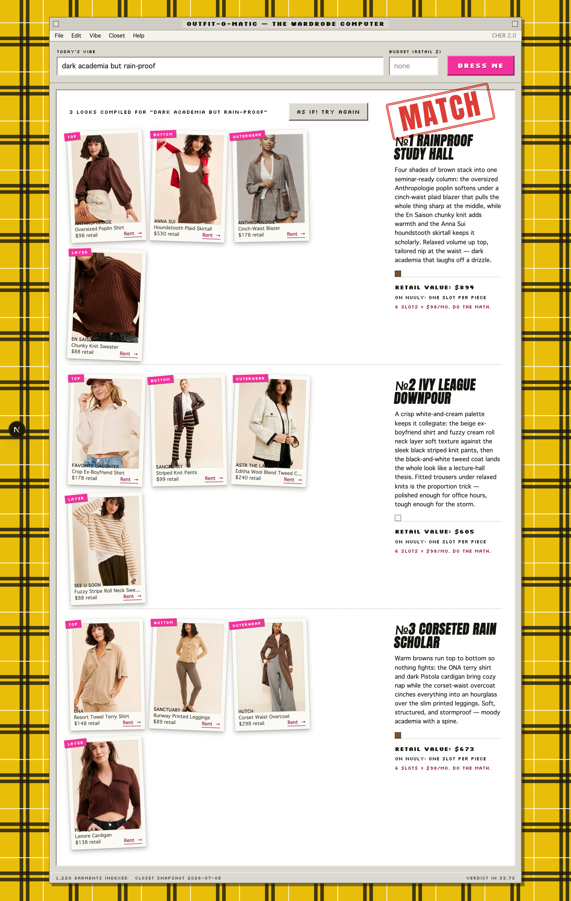

# Outfit From a Vibe — the wardrobe computer

Type a vibe — *“dark academia but rain-proof”*, *“quiet luxury on a budget”* — and get three
cohesive, rentable outfits assembled from [Nuuly](https://www.nuuly.com)’s closet, presented by a
loving parody of Cher’s outfit-matching computer from *Clueless* (1995). Every piece links back to
its live Nuuly product page.

The interesting problem here is **coherence**: pieces that look good *together*, not just pieces
that individually match the vibe. That part is deliberately not an LLM.



## Where the judgment lives (and where the models are)

This project draws a hard line between **hand-written stylist logic** and **model calls**. If an
LLM silently made all the choices, this would be a wrapper. It isn’t:

| Stage | What happens | Who decides |
|---|---|---|
| 1. Vibe expansion | `lib/search.js` — one LLM call turns the vibe into structured attributes: palette families, formality 1–5, statement tolerance, fit, base (dress vs separates), keywords, per-slot garment captions | LLM (concrete attributes only — it never sees the catalog) |
| 2. Retrieval | `lib/catalog.js` — per slot, every item is scored `0.5·attributeMatch + 0.5·CLIP(slot caption → product image)`; top 15 per slot become candidates | Local math (CLIP embeddings + attribute scoring) |
| 3. **Assembly** | `lib/stylist.js` — enumerates slot combinations and enforces rules: **pairwise visual coherence band** (mean CLIP cosine between the chosen product images must land between 0.68 and 0.85 — below reads as a clash, above as matchy-matchy), **palette rule** (a family shared by every piece, or neutrals throughout), **one statement piece max**, **fit balance** (never all-oversized; oversized ↔ fitted pairing gets a bonus), **formality spread ≤ 1**, **budget cap** on summed retail value. Produces 3 distinct looks. | **Hand-written rules. No LLM. This file is the project.** |
| 4. Explanation | `lib/explain.js` — one LLM call writes the look names + “why these work” notes for the already-chosen pieces | LLM (explains the stylist’s choices; cannot change them) |

Exactly **two LLM calls per request** (steps 1 and 4). Steps 2–3 are pure local computation over a
precomputed catalog. The coherence band was calibrated against the harvested catalog itself
(random product-image pairs: p10 ≈ 0.69, median ≈ 0.78, p90 ≈ 0.83).

`scripts/check-stylist.mjs` asserts the assembly rules against frozen fixture vibes — run
`npm run check-stylist` and it fails loudly if a rule regresses.

## The data source, honestly

**This is a committed snapshot, not a live feed.**

- Nuuly has **no public API**. Its `robots.txt` disallows `/api` and `/rent/search`, but it
  publishes a products sitemap (`/rent/products_sitemap.xml`, ~29,000 URLs) explicitly for
  crawlers, with a 1s crawl-delay.
- `scripts/harvest.mjs` samples ~1,200 products across categories from that sitemap at ~1.5s per
  request (above the declared crawl-delay), using ordinary browser headers. Each product page
  embeds a structured `initialState` JSON blob (title, brand, retail `msrpValue`, category facets,
  color hex, Scene7 image URLs) — no HTML scraping heuristics, and the disallowed `/api` routes
  are never touched.
- The result is committed as `data/catalog.json` + `data/embeddings.json`. Items retire from
  Nuuly’s rotation over time, so links can go stale; the harvest date is shown in the app’s status
  bar, and re-running `npm run harvest` refreshes the snapshot (it resumes, dedupes, and never
  re-embeds unchanged items).
- Product images are **hotlinked from Nuuly’s Scene7 CDN**, never rehosted, and every card carries
  the rental link — this is unambiguous product listing, not content republication.
- Nuuly’s bot protection (DataDome) will 403 unfamiliar clients; the harvester behaves like one
  polite returning browser session and backs off for minutes when asked. Amusingly, Nuuly’s own
  product data lists `"agentic"` among its supported channels.
- Pricing honesty: `msrpValue` is **retail value**, not a price you’d pay — Nuuly is a
  6-items-for-$98/month rental. The UI leans into exactly that (“retail value $704 … 6 slots =
  $98/mo, do the math”).

**Deviation from the original spec:** no shoes or accessory slots — Nuuly rents neither. The slot
system is top+bottom *or* dress/jumpsuit, plus outerwear and an optional knit layer.

## Stack

- **Next.js 16** (App Router, plain JS), one API route: `app/api/outfit/route.js`
- **Embeddings: local CLIP** (`@huggingface/transformers`, `Xenova/clip-vit-base-patch32`).
  Product-image embeddings are precomputed (`scripts/embed-catalog.mjs`); the vibe’s slot captions
  are embedded at request time by the quantized text encoder inside the Next.js server process.
  No inference API, no keys, no vector DB — 1,200 × 512 floats fit comfortably in memory.
- **LLM: Anthropic `claude-opus-4-8`** via `@anthropic-ai/sdk`, structured outputs
  (`output_config.format`), server-side only.
- **UI**: Cher’s computer — Mac System 7 chrome on yellow tartan, Silkscreen pixel type, polaroid
  riffle while “dialing the wardrobe”, and a rubber-stamped **MATCH** when the verdict lands.
  The **Closet** menu in the menubar holds real filters — weather and occasion, straight off the
  harvested Nuuly facets, applied as hard constraints before retrieval (no LLM). There is no size
  filter on purpose: the snapshot carries no per-size stock, so sizes live on each Nuuly listing.

## Run it

```bash
npm install
cp .env.example .env        # add ANTHROPIC_API_KEY
npm run dev
```

Requires Node ≥ 20. The committed `data/` snapshot means no harvesting is needed to run the app —
a cold clone works with just the API key.

Dev-only fallback: with no `ANTHROPIC_API_KEY` set, the two LLM calls route through a local
Claude Code CLI (`claude -p`) if one is available (`CLAUDE_CLI` in `.env`). Slower (~30s/call vs
seconds), never used in production builds.

### Rebuild the catalog snapshot

```bash
npm run harvest             # sitemap → data/catalog.json (~35 min at polite rate + LLM tagging)
npm run embed               # product images → data/embeddings.json (only new items)
npm run check-stylist       # assert the assembly rules still hold
```

Harvest-time LLM tagging gives each item `palette[]`, `formality`, `statement`, and `fit`; the
palette is unioned with a deterministic classification of the item’s actual color-swatch hex.

## Repo map

```
scripts/harvest.mjs        one-time catalog harvest (resumable, rate-limited, honest)
scripts/embed-catalog.mjs  CLIP image embeddings, cached by product ID
scripts/check-stylist.mjs  rule-engine fixtures — the stylist’s test suite
data/catalog.json          ~1,200-item tagged snapshot (committed)
data/embeddings.json       512-dim image vectors (committed)
lib/search.js              vibe → attributes (LLM call #1 — the only prompt for it)
lib/catalog.js             candidate retrieval scoring
lib/embed.js               local CLIP text encoder + cosine helpers
lib/stylist.js             ★ the rules engine — read this file first
lib/explain.js             look names + notes (LLM call #2, post-assembly)
app/api/outfit/route.js    expand → retrieve → assemble → explain
app/components/            the Clueless treatment
```

## Known limits

- Coherence is subjective; a weak look will happen. That’s what **“AS IF! TRY AGAIN”** is for — it
  re-runs assembly excluding every item already shown.
- The snapshot ages: Nuuly rotates items in and out, so occasional links 404 until re-harvest.
- CLIP sees the product photo (usually on a model, styled) — some of an item’s “vibe score” comes
  from the photography, not the garment. The attribute half of the retrieval score, and the
  palette/formality/statement rules, keep that honest.
